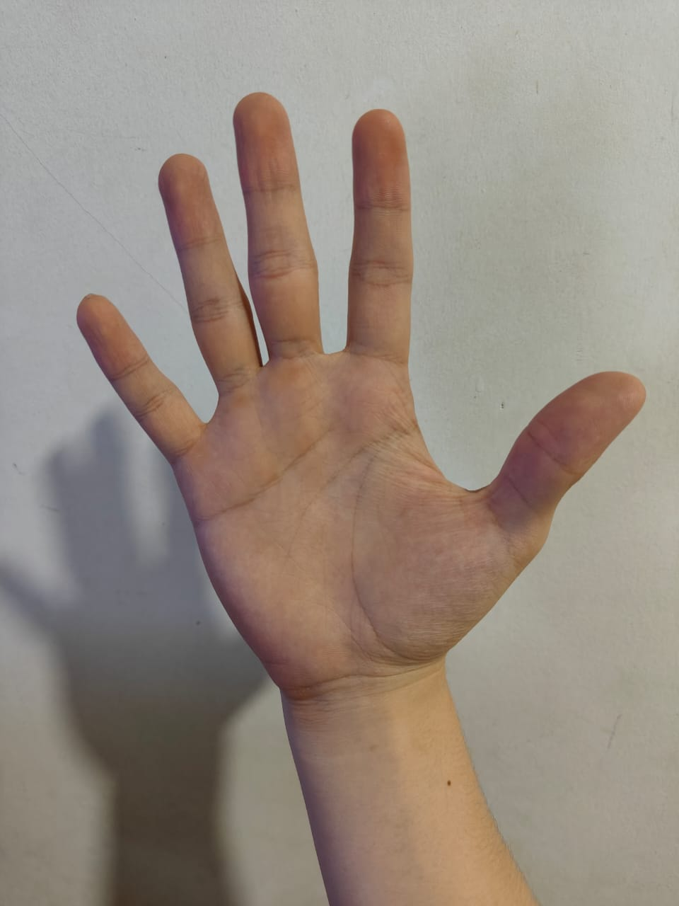
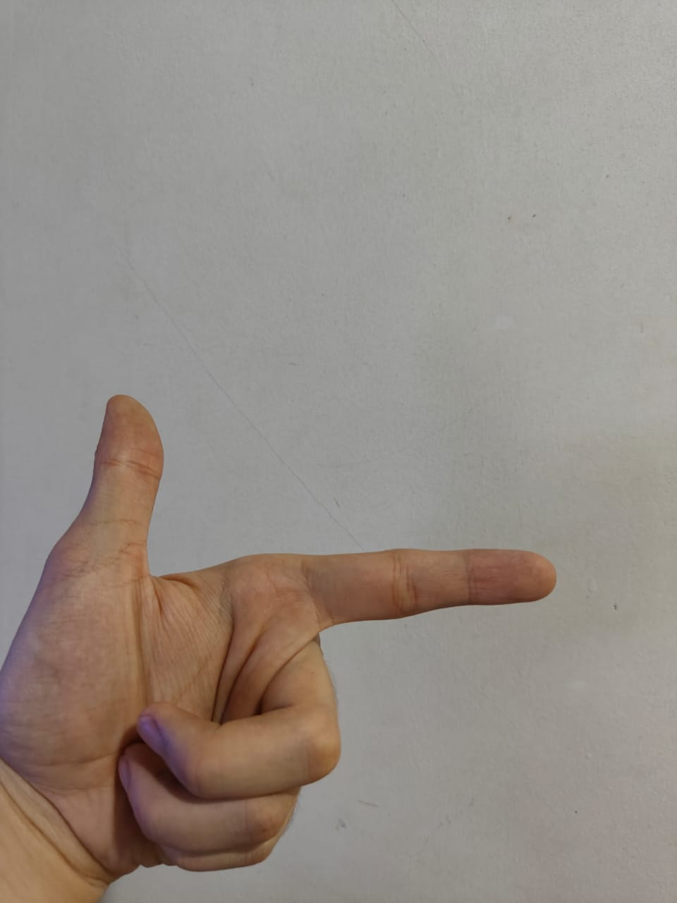
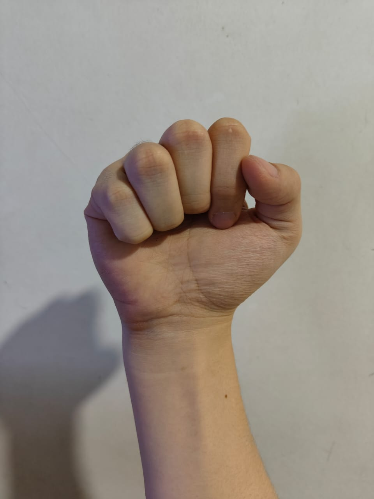
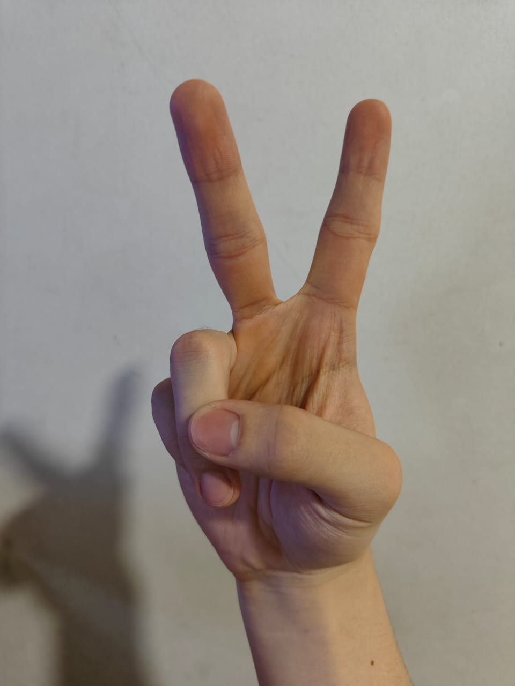
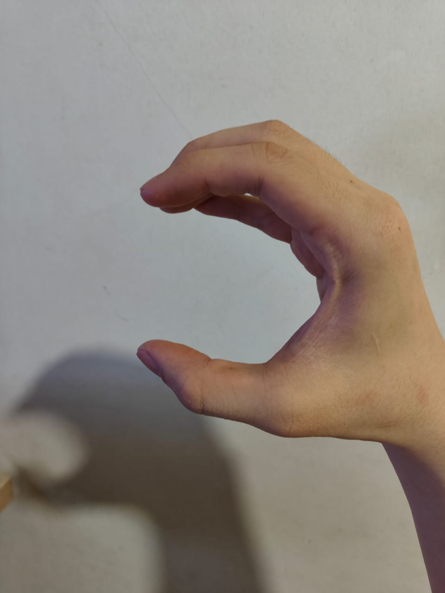
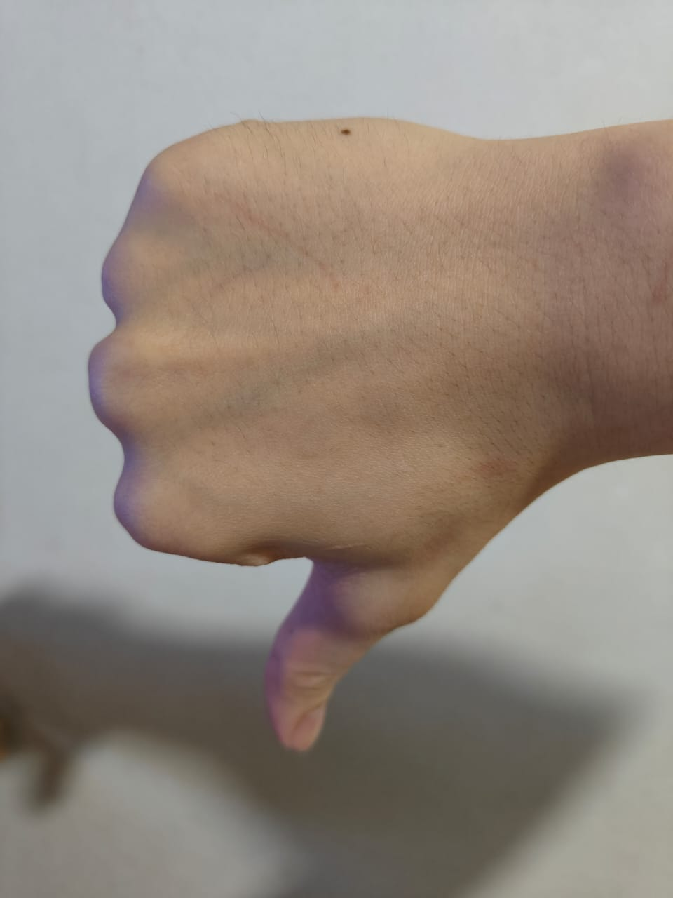
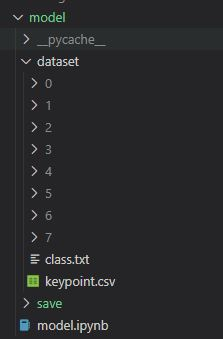

# CONTROL YOUR PC WITH HAND GESTURE DETECTION

## What can this do?
You can freely perform some magic functions on your device. These are some simple functions and their respective handgestures: 
1. Play/pause

2. Backward (Point to left)

3. Forward (Point to right)

4. Screenshot

5. Paste

6. Copy

7. Volume up

8. Volume down


*Both left and right hands are usable, but only one hand at a time.
## Demo
Here's how to run the demo using your webcam:
```bash
python app.py
```

## Learn to create your own model!
Environment setup:
1. Run createEnv.bat, it will install all the requirements needed for the app to run.

Data Preprocessing:
1. First, collect your own dataset by refering to here [hand-gesture-recognition-mediapipe](https://github.com/kinivi/hand-gesture-recognition-mediapipe). 
2. You should collect 8 classes of dataset (0-7) if you want to use our pre-built magic functions.
3. After collecting the dataset and compile it as .csv file, run this line.
You will see folders are created in model/dataset for each data classes.


```bash
python train/preprocess.py
```
## Modeling
1. In this case, we are using 2 layers of fully-connected layer to predict the input handgestures
2. The model is stored in train/model_landmark.py. Feel free to change the structure of the model.

## Training 
1. Run train/train_landmark.py by type in the code below. This will start your model training process.
```bash
python train/train_landmark.py
```
2. The model trained will be stored in model/save as model.pth

## Summary
Congrats! Now you have built your very own app with your own handgestures! Just run "python app.py" to start testing out your app.